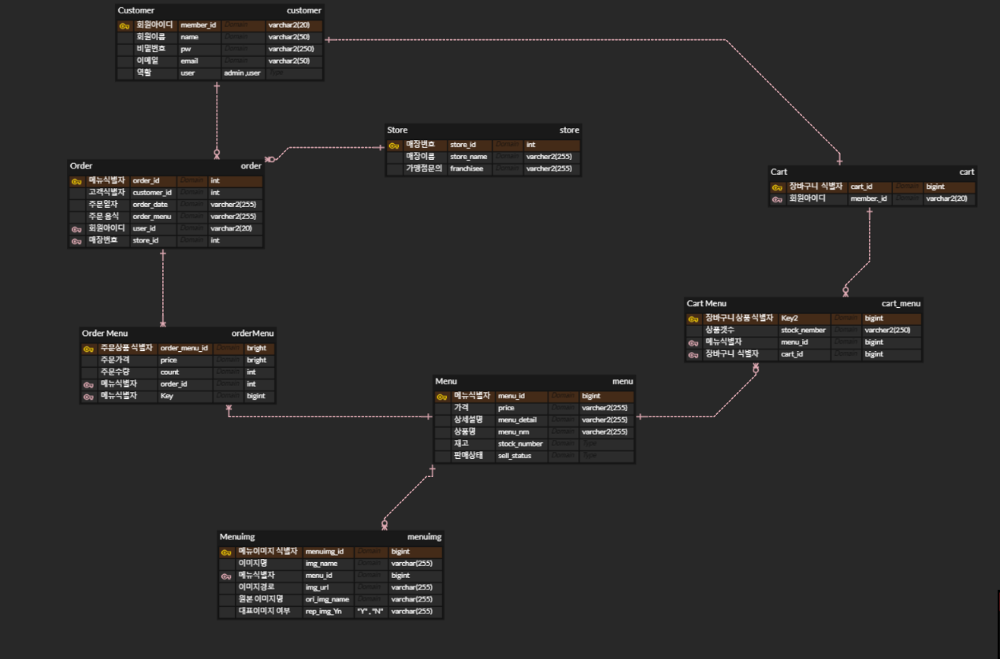
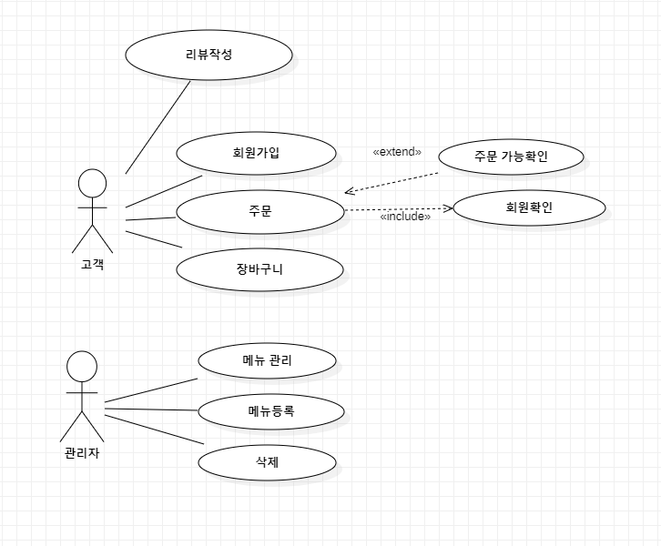

## 🎊프로젝트 소개
스프링 부트 + JSP를 이용한 음식주문 사이트

## ⏰개발 기간 (Table of Contents)
* 23.07.17 - 23.08.16일
 
### 🧑‍💻멤버구성
개인프로젝트 
- 이진우 - 주문, 장바구니, 로그인, 회원가입, 주문관리(CRUD), 관리자페이지, 
         고객의 소리(CRUD),가맹점문의,메뉴 관리,메뉴수정(CRUD)

### 🧰개발 스텍
- LANGUAGE : ,, , ,
- FRAMEWORK : , , 
- DB : 
- SECURITY : 
- BULID : 
- TOOL : 
- ORM : 

##
### ERD                                        ### USECASE
 | 
---|---|

------------

## 📣사용한 기술들
### JPA
<pre><code>
 public interface CartMenuRepository extends JpaRepository<CartMenu, Long> {
	CartMenu findByMenuAndCart(Menu menu, Cart cart);

	@Query("select new com.feane.dto.CartDetailDto(ci.id, i.menuNm, i.price, ci.count, im.imgUrl, ci.menu.id menuId) "
			+ "from CartMenu ci, MenuImg im " + "join ci.menu i " + "where ci.cart.id = :cartId "
			+ "and im.menu.id = ci.menu.id " + "and im.repimgYn = 'Y' " + "order by ci.regTime desc")
	List<CartDetailDto> findCartDetailDtoList(@Param("cartId") Long cartId);

} 
</code></pre>
- `@Query`: JPQL 쿼리를 사용합니다. 해당 메소드는 CartDetailDto특정 DTO를 사용하여 장바구니 정보를 상세하게 조회합니다.
- `CartMenu findByMenuAndCart(Menu menu, Cart cart)`: 카트에 담겨있는 메뉴와 카트를 기반으로 CartMenu분리를 조회하는 방법입니다. 생성된 메서드 이름은 Spring Data JPA에서 생성되어 해당 조건에 맞는 데이터를 조회하는 쿼리를 자동으로 생성합니다.
------------ 
### Security
<pre><code>
@Configuration // Bean 객체를 싱글톤으로 객체를 관리해준다.
@EnableWebSecurity 
public class SecurityConfig {
	@Bean
	public SecurityFilterChain filterChain(HttpSecurity http) throws Exception {
		// 로그인에 대한 설정
		http.authorizeHttpRequests(authorize->authorize//1.페이지 접근에 관한
				//모든 사용자가 로그인(인증) 없이 접근할수 있도록 설정
				.requestMatchers("/css/**","/js/**","/img/**","/images/**","/fonts/**").permitAll()
				.requestMatchers("/","/members/**","/menu/**", "/franchisee/**","/member/**","/order/**","/cart/","/about/").permitAll()
				.requestMatchers("/favicon.ico","/error").permitAll()
				//'admin'으로 시작하는 경로는 관리자만 접근가능하도록 설정
				.requestMatchers("/admin/**").hasRole("ADMIN")
				.anyRequest().authenticated()//그외 페이지는 모두 로그인 (인증을 받아야한다.)
				)
	
		return http.build();		
	}

}
------------	
### Security
</code></pre>
- `@EnableWebSecurity` : Spring Security를 ​​활성화하는 어노테이션입니다.
- `SecurityFilterChain filterChain(HttpSecurity http)` : SecurityFilterChain을 반환하는 메서드로, Spring Security의 검색 체인을 설정합니다.
- `http.authorizeRequests()` : 요청에 대한 권한을 설정합니다.
- `requestMatchers()`로 특정 요청을 참여시키고, permitAll()사용하여 외부 접근 가능하도록 설정합니다.
- `anyRequest().authenticated()`: 그 외의 모든 요청은 인증된 사용자만 접근 가능하도록 설정됩니다.
-`http.build()` : 설정한 내용을 http작성하여 SecurityFilterChain생성합니다.
------------
### Spring MVC
<pre><code>
@PostMapping(value = "/cart")
	public @ResponseBody ResponseEntity order(@RequestBody @Valid CartMenuDto cartMenuDto, BindingResult bindingResult,
			Principal principal) {

		if (bindingResult.hasErrors()) {
			StringBuilder sb = new StringBuilder();
			List<FieldError> fieldErrors = bindingResult.getFieldErrors();

			for (FieldError fieldError : fieldErrors) {
				sb.append(fieldError.getDefaultMessage());
			}

			return new ResponseEntity<String>(sb.toString(), HttpStatus.BAD_REQUEST);
		}

		String email = principal.getName();
		Long carMenuId;

		try {
			carMenuId = cartService.addCart(cartMenuDto, email);
		} catch (Exception e) {
			return new ResponseEntity<String>(e.getMessage(), HttpStatus.BAD_REQUEST);
		}

		return new ResponseEntity<Long>(carMenuId, HttpStatus.OK);
	}
</code></pre>
- `@PostMapping(value = "/cart")`: 해당 URL에 POST 요청이 있으면 이 메서드를 처리합니다.
- `@RequestBody @Valid CartMenuDto cartMenuDto`: 데이터를 CartMenuDto매핑하며, 주문 생성에 필요한 정보를 갖고 있습니다.
- `BindingResult bindingResult` : 검증 오류가 발생할 경우 오류 내용을 보관하는 스프링 프레임워크에서 제공하는 객체입니다.
- `Principal principal` : 현재 로그인한 사용자의 정보를 `getName()`값으로 제공합니다.
-  `cartService` : 주문 생성에 참여하고 로그인한 사용자의 정보를 얻은 경우 `cartService`를 이용해 주문을 생성합니다.
-  예외 처리: 소스 생성 백업이 발생한 경우 포함된 보존 상태 코드를 반환합니다
-  응답 반환: 주문 생성이 성공하면 주문의 `ID`와 `OK`상태를 유지합니다.
------------

